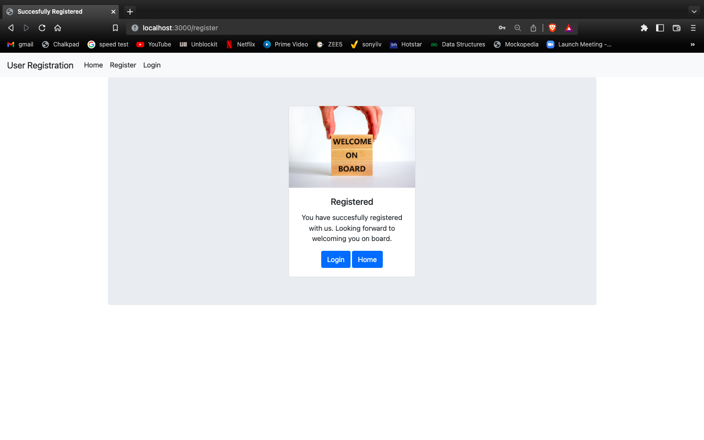
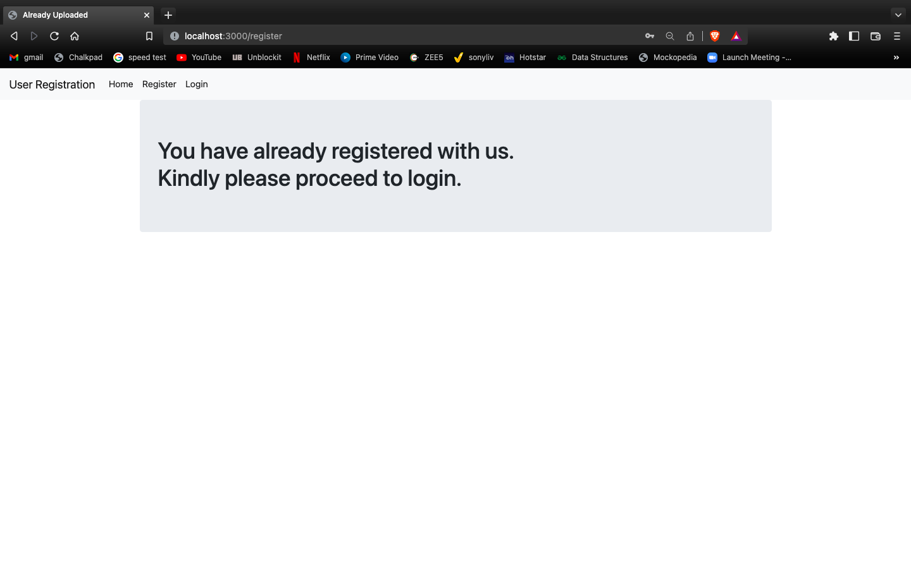
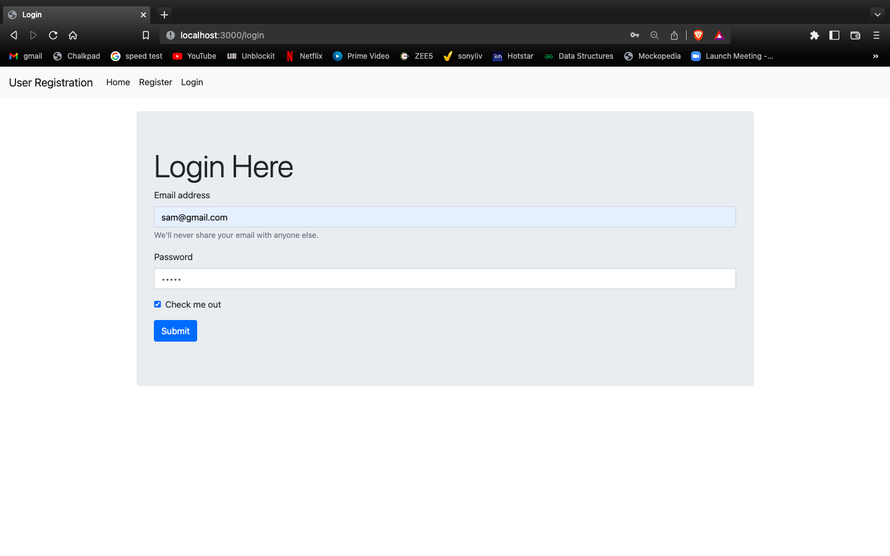
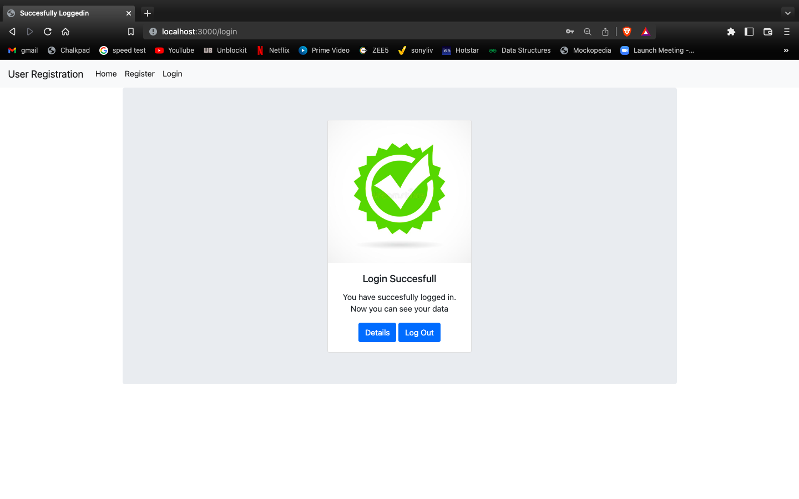
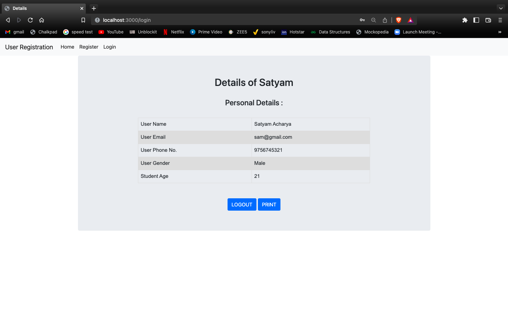
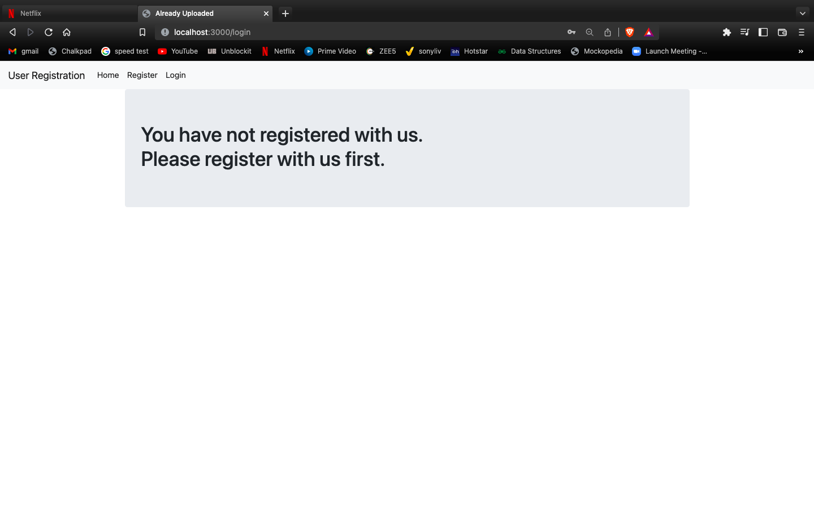
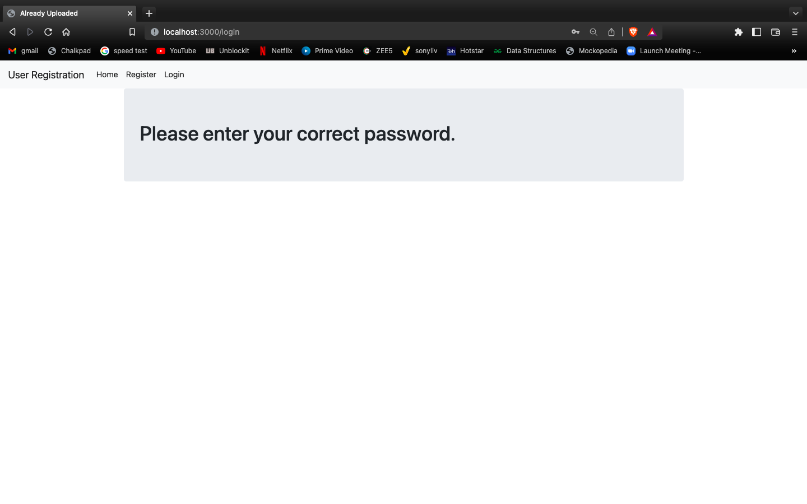
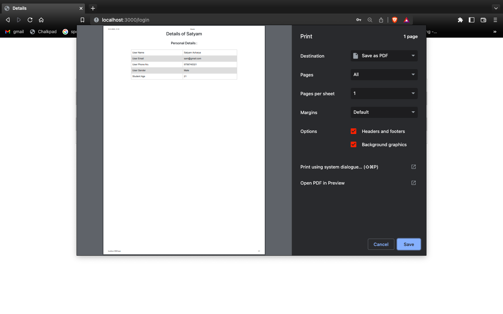
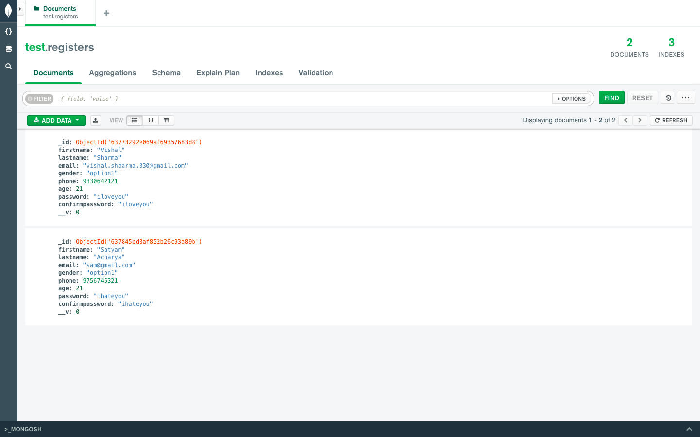

# User Registration
User registration in MERN STACK.

# Technology Used
NODE-JS, EXPRESS-JS, MongoDB, Mongoose, Handlebars

# Project Description
It's a Login System that user can create a account and can login into his account using his valid login credentials at any time. All the user credentials are stored in MongoDB database cluster.

# Project Features

1) It stores all the data in a MongoDb cluster so if you dont have mongodb on your local device it isn't such a issue.
2) It has a navbar which works through out every page of the project.
3) It checks whether password and confirm password are really same or not.
4) It does not allow a email address to be used for multiple registrations.
5) It takes you to a logged in page if your credentials are matching.
6) After succesully logging in you will be taken to a page from where u can get to know the details or logout.
7) It show all the details you entered after logging in.
8) You can print all the details of a particular user.
9) It doesnt allows you to enter numbers in names field.
10) It's a very optimized code.

# How to start the Project

```
npm install node
npm run dev
```
After that go to your web browser and type http://localhost:3000/

# SCREENSHOTS
 HOME PAGE


 REGISTER YOUR DETAILS

 
 SUCCESFULLY REGISTERED


 IF ALREADY REGISTERED


 LOGIN PAGE


 SUCCESSFULL LOGIN

 
 DETAILS PAGE


 IF YOU ARE NOT REGISTERED

 
 IF YOU ENTER A WRONG PASSWORD


 PRINT


 DATABASES WHERE ITS ALL STORED


## Copyright and License

Copyright (c) 2021-2022, Vishal Sharma, Chitkara University, Nishchal Sir.

This project is licensed under the [MIT License](LICENSE.md).


